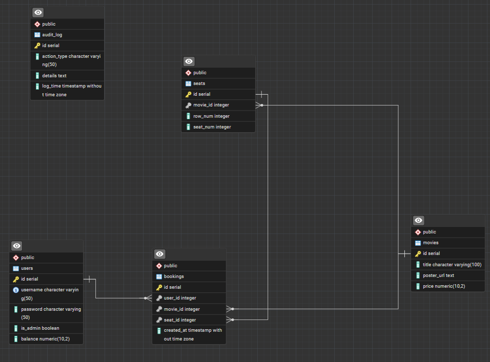
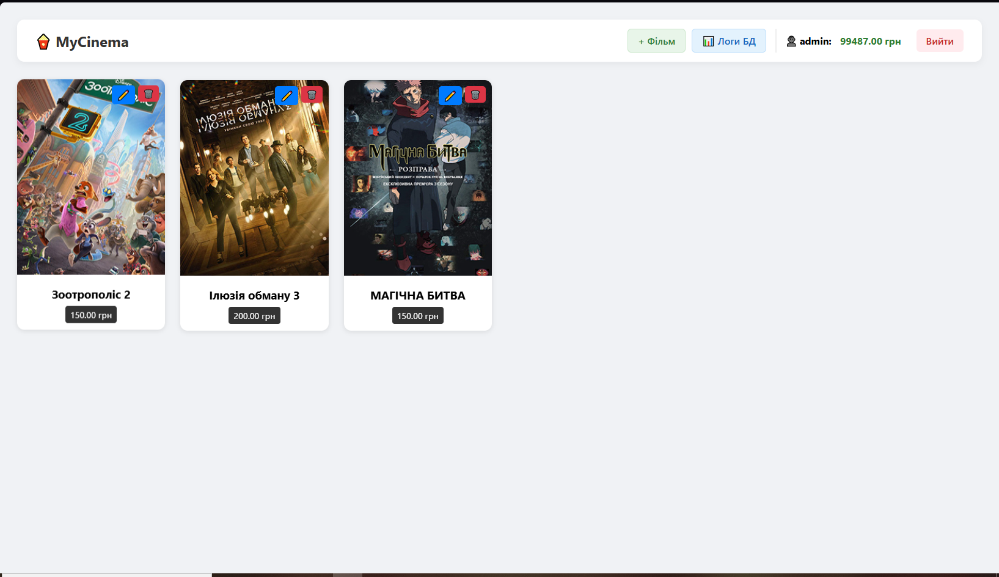
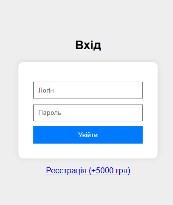
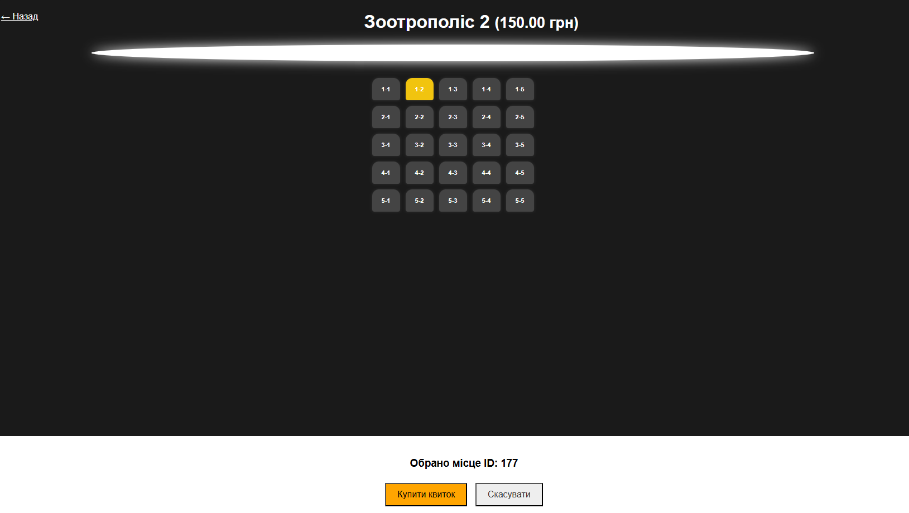
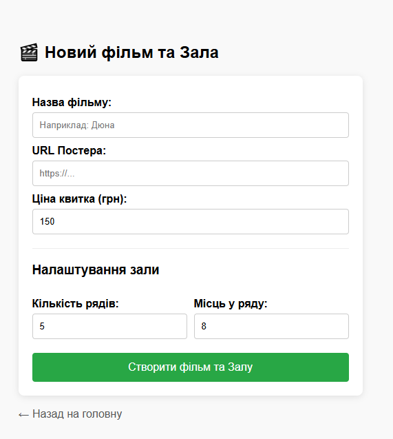
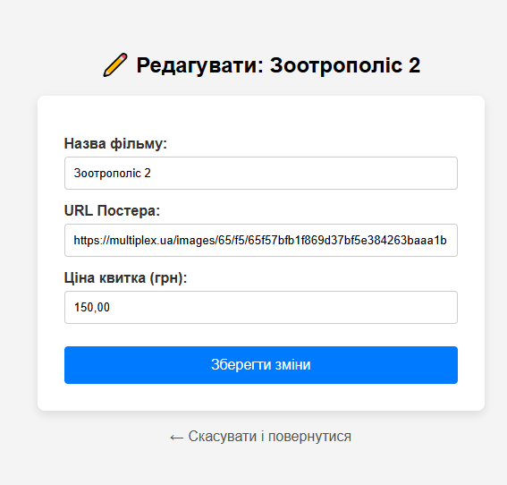

# 🎬 Cinema Booking System

Веб-додаток для купівлі квитків у кінотеатрі.****
Головна особливість проекту — **бізнес-логіка винесена на рівень бази даних** (PostgreSQL) з використанням збережених процедур, транзакцій та тригерів для аудиту.

---

## 🚀 Основний функціонал

### 👤 Для Користувача
* **Реєстрація та Вхід:** Система акаунтів. При реєстрації користувач отримує стартовий бонусний баланс.
* **Інтерактивна Афіша:** Перегляд доступних фільмів з постерами та цінами.
* **Вибір місця:** Візуальна схема залу (CSS Grid + Flexbox).
    * Різні статуси місць: 🟩 **Вільне** (Можна купити), *Продано* (Неклікабельне).🟨 **Обране** (Підсвічується при кліку)
    *  анімація крісел.
* **Покупка квитків:** Миттєва транзакція зі списанням коштів з балансу, місце закріплюється за користувачем..

### 🛡️ Для Адміністратора
* **CRUD Фільмів:** Додавання, Редагування та Видалення фільмів.
* **Динамічні зали:** При створенні фільму адмін вказує розмір зали (кількість рядів та місць), і база даних автоматично генерує структуру.
* **Audit Log (Журнал подій):** Перегляд логів, які автоматично створюються тригерами в БД при будь-якій дії (додавання фільму, зміна ціни, покупка квитка).

---

## 💾 Архітектура Бази Даних (SQL Magic)

Проект використовує **PostgreSQL** на повну потужність. Python (Flask) виступає лише як інтерфейс, вся логіка надійно захищена в БД.

### 1. Збережені Процедури (Stored Procedures)
Всі операції зміни даних йдуть через `CALL`:
* **`buy_ticket_proc`**: Атомарна транзакція. Перевіряє наявність місця, баланс користувача, списує кошти та видає квиток. Використовує механізм `ON CONFLICT` для уникнення дублікатів.
* **`add_movie_proc`**: Створює фільм і автоматично генерує сітку місць у таблиці `seats` відповідно до заданих параметрів (ряди/колони).
* **`edit_movie_proc`**: Безпечне оновлення даних фільму.


---
### 1. Збережені Процедури (Stored Procedures)
Всі критичні операції виконуються через `CALL`:
* `buy_ticket_proc(user_id, movie_id, seat_id)` — Виконує перевірку статусу місця, балансу користувача, списує кошти та видає квиток в одній транзакції. Використовує `ON CONFLICT` для надійності.
* `add_movie_proc(...)` — Створює фільм і автоматично генерує сітку місць у таблиці `seats`.
* `delete_movie_proc(...)` — Каскадне видалення фільму разом з усіма сеансами та квитками.

### 2. Тригери (Triggers)
Система автоматично веде аудит у таблиці `audit_log`:
* **`trg_audit_bookings`**: Реагує на `INSERT` у таблиці квитків. Записує назву фільму та номер купленого місця.
* **`trg_audit_movies`**: Реагує на будь-які зміни в таблиці фільмів.
    * При `UPDATE`: Порівнює `OLD` та `NEW` значення і записує конкретні зміни (наприклад: *"Ціна змінилася з 100 на 150"*).

---

## 🛠️ Встановлення та Запуск
### 1. Клонування та бібліотеки
```bash
# Встановіть необхідні бібліотеки
pip install flask psycopg2-binary
2. Налаштування Бази Даних
Створіть базу даних cinema у PostgreSQL.
Оновіть налаштування підключення у файлі app.py:
Python
def connect_db():
    debug("Connecting to DB.")
    conn = psycopg2.connect(host="localhost", user="postgres", password="admin", dbname="cinema",
                            cursor_factory=psycopg2.extras.DictCursor)
    return conn
    
Виконайте SQL-скрипт (структура таблиць, процедури та тригери) в консолі .
$env:FLASK_APP="main"
flask init
flask sample-db


3. Запуск
python app.py
Перейдіть за адресою: http://127.0.0.1:5000

📂 Структура Проекту
CinemaProject/
│
├── app.py                # Головний файл (Flask Backend)
├── templates/            # HTML Шаблони
│   ├── index.html        # Головна (Афіша + Адмінка)
│   ├── login.html        # Вхід / Реєстрація
│   ├── hall.html         # Схема залу та покупка
│   ├── add_movie.html    # Форма додавання фільму
│   └── edit_movie.html   # Форма редагування
└── README.md             # Документація
```
### Головна сторінка 


### Логін та Реєстрація


### Вибір місця в залі




### Додавання фільму

### Редагування фільму



### Логи бази даних (Audit Log)

